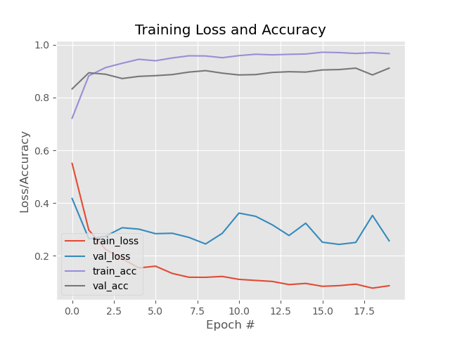

# Face Mask Detection System 😷

A Python-based real-time face mask detection system using deep learning, OpenCV, and TensorFlow/Keras.

## 📁 Project Structure

```
.
├── dataset/                   # Contains dataset images
├── face_detector/            # Pre-trained face detector model (deploy.prototxt, res10_300x300_ssd.caffemodel)
├── detect_mask_video.py      # Detects masks via webcam/video
├── train_mask_detector.py    # Trains the mask detection model
├── mask_detector.keras       # Saved trained model
├── plot.png                  # Training accuracy/loss visualization
├── requirements.txt          # Python dependencies
└── README.md                 # Project overview
```

## 🚀 Getting Started

### 1. Clone the repository

```bash
git clone https://github.com/your-username/face-mask-detection.git
cd face-mask-detection
```

### 2. Install dependencies

```bash
pip install -r requirements.txt
```

### 3. Train the model

```bash
python train_mask_detector.py
```

### 4. Detect mask in video

```bash
python detect_mask_video.py
```

## 📊 Output

- **Training Plot:**  
  

## 📦 Requirements

See `requirements.txt`:

```
tensorflow>=1.15.2
keras==2.3.1
imutils==0.5.3
numpy==1.18.2
opencv-python==4.2.0.*
matplotlib==3.2.1
scipy==1.4.1
```

## 🤝 Credits

- Model based on MobileNetV2
- Face detection using OpenCV's Caffe model
- Dataset: Custom or sourced from public datasets

---

**Author:** Akher Uddin Ahmed
**License:** MIT
